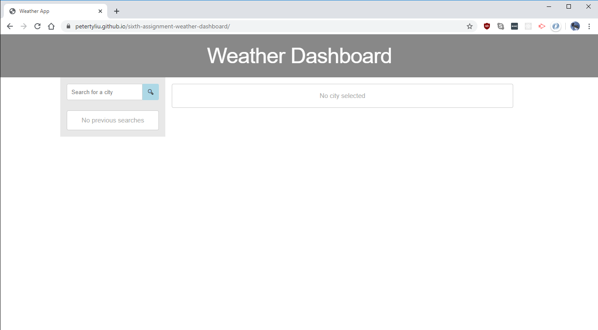
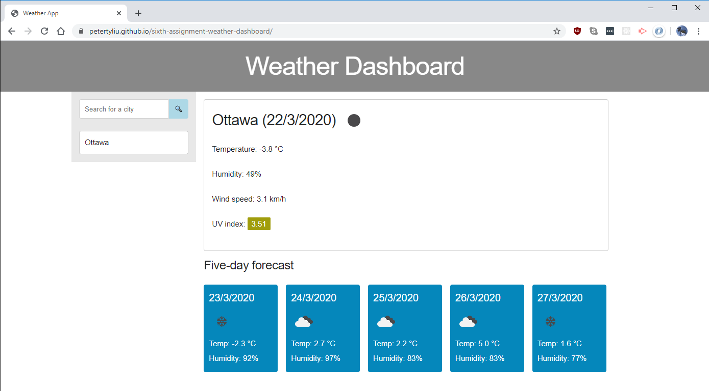
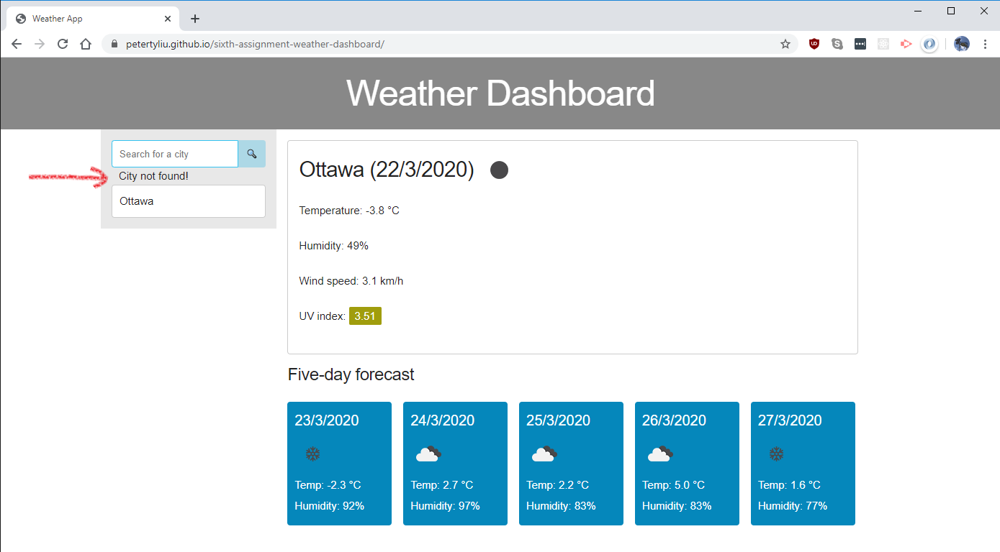
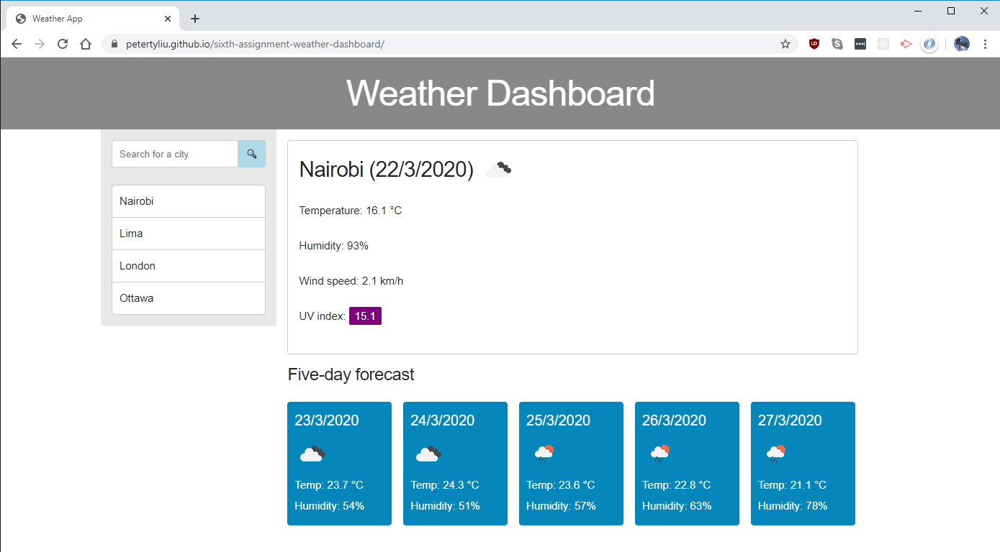

# Assignment 6: Weather dashboard

## Building a dashboard which displays current weather conditions for any city, as well as a 5-day forecast. Allows the user to access their search history offline via local storage.

When the site is first opened, there is no info nor history.

When the user enters a valid city into the serach bar, results for that city will fill the main section. The top area shows the current weather, while the five-day forecast shows weather conditions at 3:00 PM across the next five days.

Entering an invalid search term will yield an error message

When cities are searched, they are saved in the history section, and can be accessed offline via local storage. When the user visits the site, their last-searched city will be shown.

## Link to live site: https://petertyliu.github.io/sixth-assignment-weather-dashboard/
